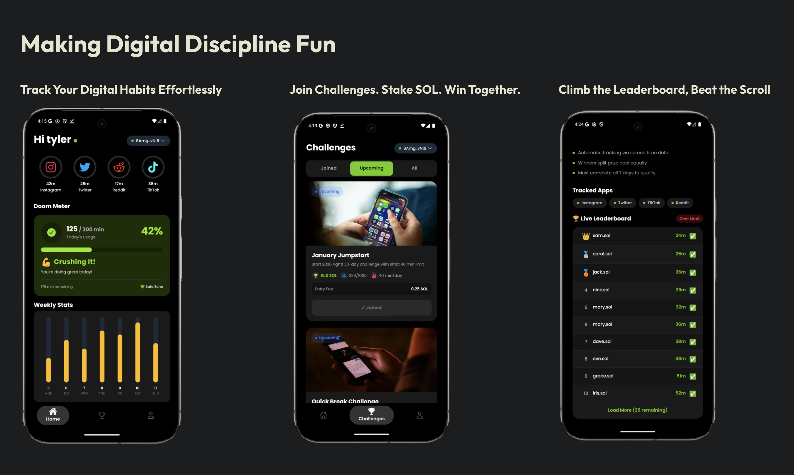

# Doomscroll Mobile App



<div align="center">

**React Native mobile application for breaking social media addiction through gamified challenges**

[](https://reactnative.dev/)
[](https://expo.dev/)
[](https://www.typescriptlang.org/)
[](https://solana.com)

</div>

---

## 📱 Overview

The Doomscroll mobile app is a React Native application built with Expo that helps users track their social media usage, join challenges, and win SOL rewards for building better digital habits.

## ✨ Features

### 🎯 Core Functionality
- **Screen Time Tracking**: Automatic monitoring of Instagram, Twitter, Reddit, and TikTok
- **Doom Meter**: Visual indicator showing daily usage vs. limit
- **Activity Rings**: Per-app breakdown of daily usage
- **Weekly Analytics**: 7-day usage graph with trends

### 🏆 Challenge System
- **Browse Challenges**: Filter by Joined/Upcoming/All
- **Join with SOL**: Pay entry fees via Phantom wallet
- **Live Leaderboards**: Real-time rankings and competition
- **Challenge Details**: Full info, rules, and daily progress tracking

### 💰 Wallet Integration
- **Phantom Wallet**: Seamless Solana Mobile Wallet Adapter integration
- **Transaction Signing**: Secure challenge entry and reward claims
- **Balance Display**: View SOL balance and transaction history

### 🎨 User Interface
- **Dark Theme**: Beautiful, modern dark UI
- **Smooth Animations**: Native-feeling transitions
- **Bottom Tab Navigation**: Easy access to Home, Challenges, and Profile
- **Responsive Design**: Optimized for various screen sizes

## 🛠 Tech Stack

- **Framework**: React Native with Expo SDK 52
- **Language**: TypeScript
- **Styling**: NativeWind (Tailwind CSS for React Native)
- **Navigation**: React Navigation v6 (Bottom Tabs + Stack)
- **State Management**: React Context API + TanStack Query
- **Wallet**: Solana Mobile Wallet Adapter
- **Storage**: AsyncStorage for local persistence
- **Fonts**: Poppins (Google Fonts via expo-google-fonts)
- **Icons**: Ionicons

## 🚀 Getting Started

### Prerequisites

```bash
# Node.js 18+
node --version

# Yarn or npm
yarn --version

# Expo CLI
npm install -g expo-cli
```

### Installation

1. **Install Dependencies**
```bash
cd client
yarn install
```

2. **Configure Environment**
```bash
# Update app.json with your settings
# Set your API endpoint in src/services/api.ts
```

3. **Start Development Server**
```bash
yarn start
```

4. **Run on Device**

For Android (requires custom dev build):
```bash
# Build development client
yarn build:local

# Or use EAS Build
yarn build

# Run on connected device
yarn android
```

For iOS:
```bash
yarn ios
```

## 📁 Project Structure

```
client/
├── src/
│   ├── components/          # Reusable UI components
│   │   ├── modals/         # Modal components
│   │   ├── screens/        # Screen-specific components
│   │   │   ├── home/       # Home screen components
│   │   │   └── challenges/ # Challenge components
│   │   └── wallet/         # Wallet-related components
│   ├── screens/            # Main screen components
│   │   ├── HomeScreen.tsx
│   │   ├── ChallengesScreen.tsx
│   │   ├── ProfileScreen.tsx
│   │   └── ChallengeDetailScreen.tsx
│   ├── navigators/         # Navigation configuration
│   │   └── AppNavigator.tsx
│   ├── contexts/           # React Context providers
│   │   └── UserContext.tsx
│   ├── hooks/              # Custom React hooks
│   │   └── useJoinChallenge.ts
│   ├── services/           # API services
│   │   └── api.ts
│   └── utils/              # Utility functions
│       ├── useAuthorization.tsx
│       └── useMobileWallet.tsx
├── assets/                 # Images, fonts, etc.
│   ├── logo.png
│   ├── avatar.jpeg
│   └── challenges/         # Challenge images
├── app.json               # Expo configuration
├── package.json
└── tailwind.config.js     # NativeWind configuration
```

## 🔧 Configuration

### app.json
```json
{
  "expo": {
    "name": "Doomscroll",
    "slug": "doomscroll",
    "scheme": "doomscroll",
    "userInterfaceStyle": "dark"
  }
}
```

### API Configuration
Update the API endpoint in `src/services/api.ts`:
```typescript
const API_BASE_URL = 'http://your-server-url:3000';
```

## 📦 Key Dependencies

```json
{
  "@solana-mobile/mobile-wallet-adapter-protocol": "^2.2.2",
  "@solana-mobile/mobile-wallet-adapter-protocol-web3js": "^2.2.2",
  "@solana/web3.js": "^1.78.4",
  "@react-navigation/native": "^6.1.14",
  "@react-navigation/bottom-tabs": "^6.5.16",
  "@tanstack/react-query": "^5.24.1",
  "expo": "^52.0.43",
  "react-native": "0.76.9",
  "nativewind": "^4.2.1"
}
```

## 🎨 Styling

This project uses **NativeWind** (Tailwind CSS for React Native):

```tsx
// Example usage
<View className="flex-1 bg-black p-4">
  <Text className="text-white text-xl font-bold">
    Hello Doomscroll
  </Text>
</View>
```

Custom colors defined in `tailwind.config.js`:
- `primary`: #000000 (Black)
- `secondary`: #1a1a1a (Dark Gray)
- `lime-500`: #84cc16 (Brand Green)

## 🔐 Wallet Integration

### Connecting Wallet
```typescript
import { useMobileWallet } from '../utils/useMobileWallet';

const { connect } = useMobileWallet();
await connect();
```

### Signing Transactions
```typescript
import { useJoinChallenge } from '../hooks/useJoinChallenge';

const { joinChallenge } = useJoinChallenge();
await joinChallenge(challengeId, '0.5 SOL');
```

## 📱 Screens

### Home Screen
- Welcome message with username
- Activity rings (per-app usage)
- Doom meter (daily progress)
- Weekly graph
- Challenge progress

### Challenges Screen
- Filter tabs (Joined/Upcoming/All)
- Challenge cards with status badges
- Join/View Details buttons
- Entry fee and participant count

### Challenge Detail Screen
- Challenge header with image
- Quick stats (participants, pool, threshold)
- Challenge info and rules
- Daily progress calendar
- Live leaderboard
- Join/View Details CTA

### Profile Screen
- User avatar and wallet address
- Quick stats (Challenges, Wins, SOL earned)
- Achievements section
- Settings and logout

## 🧪 Development

### Running Tests
```bash
yarn test
```

### Linting
```bash
yarn lint
```

### Type Checking
```bash
yarn tsc
```

## 📱 Building for Production

### Android
```bash
# Create production build
eas build --platform android --profile production

# Or local build
eas build --platform android --profile production --local
```

### iOS
```bash
eas build --platform ios --profile production
```

## 🐛 Troubleshooting

### Metro Bundler Issues
```bash
# Clear cache
yarn start --clear

# Reset Metro
rm -rf node_modules/.cache
```

### Wallet Connection Issues
- Ensure Phantom wallet is installed
- Check that you're on the correct network (devnet/mainnet)
- Clear AsyncStorage: `AsyncStorage.clear()`

### Build Errors
```bash
# Clean and reinstall
rm -rf node_modules
yarn install

# Rebuild native modules
npx expo prebuild --clean
```

## 🤝 Contributing

1. Follow the existing code style (TypeScript + NativeWind)
2. Test on both Android and iOS if possible
3. Update this README if adding new features
4. Ensure all TypeScript types are properly defined

## 📄 License

MIT License - see the [LICENSE](../LICENSE) file for details.

---

<div align="center">

**Built with ❤️ using React Native and Solana**

</div>

